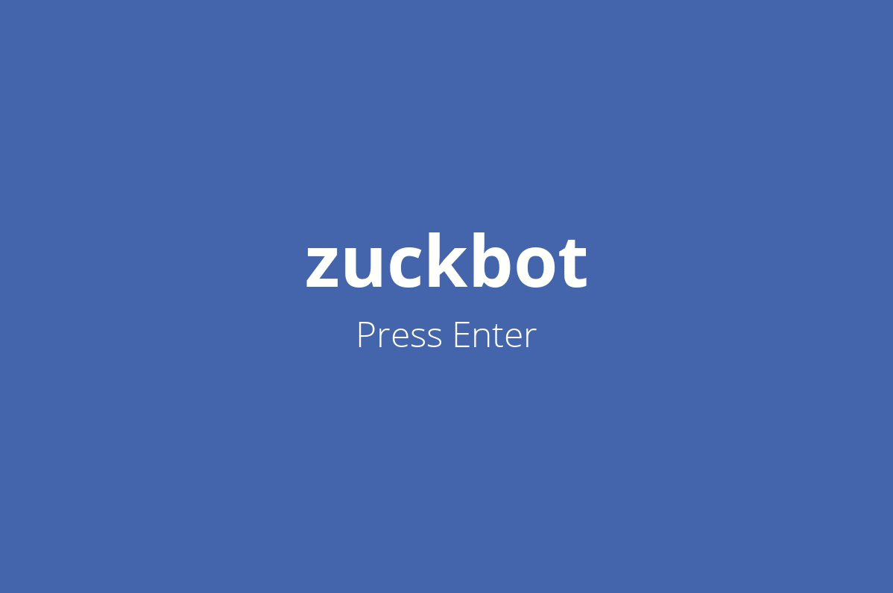

`zuckbot` is a virtual reincarnation of [Mark Zuckerberg](https://en.wikipedia.org/wiki/Mark_Zuckerberg) encapsulated in a desktop application. Users are given the ability to ask `zuckbot` a question and be given a one of over twenty different responses.

### Background

`zuckbot` was made in partial completion of [Stanford University's Code In Place 2021](https://codeinplace.stanford.edu/) submission requirements, serving as the author's final project. With the course's emphasis on learning the fundamentals of Python, this project well encompasses the usage of many of the language's best features and makes for a proper showcase of the skills learned throughout Code In Place's eight weeks.

It is also worth noting that the following external libraries were used in the creation of `zuckbot`:

- [`pygame`](https://www.pygame.org/)
- [`pygame-text-input`](https://github.com/Nearoo/pygame-text-input)

### Installation

1. [Install Python](https://www.python.org/downloads/) (if such is not already installed). Version **3.8.5** and above is recommended.

2. Clone the repository with `git clone https://github.com/FrancisLangit/zuckbot` or download it as a `.zip` file and extract it.

3. Navigate to wherever the repository is saved on you local machine and install its dependencies with:

   ```py
   $ pip install -r requirements.txt
   ```

   If `pip` isn't already installed, install it by [following these instructions](https://pip.pypa.io/en/stable/installing/).

4. Navigate to the repository's `/zuckbot` folder and run `main.py`:

   ```
   $ python main.py
   ```

### Usage



Users are given access to interacting with `zuckbot` upon pressing `enter` in the title screen. He responds well to any yes or no question but anyone is very welcome to input other strings that they may think he will find amusing. On that that note, `zuckbot's`  personality is rather shy. You might find him going surfing or asking for legal counsel first before answering your question, so be patient.

### Contributing

Pull requests are welcome for those that would like to make a contribution. If one would like to apply major changes to the repository please open up an issue first to discuss what you'd like to do.

### License

[MIT License](https://github.com/FrancisLangit/zuckbot/blob/main/LICENSE)